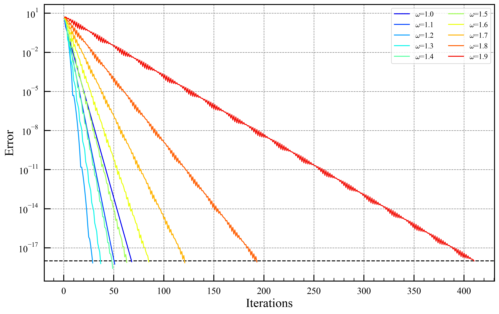
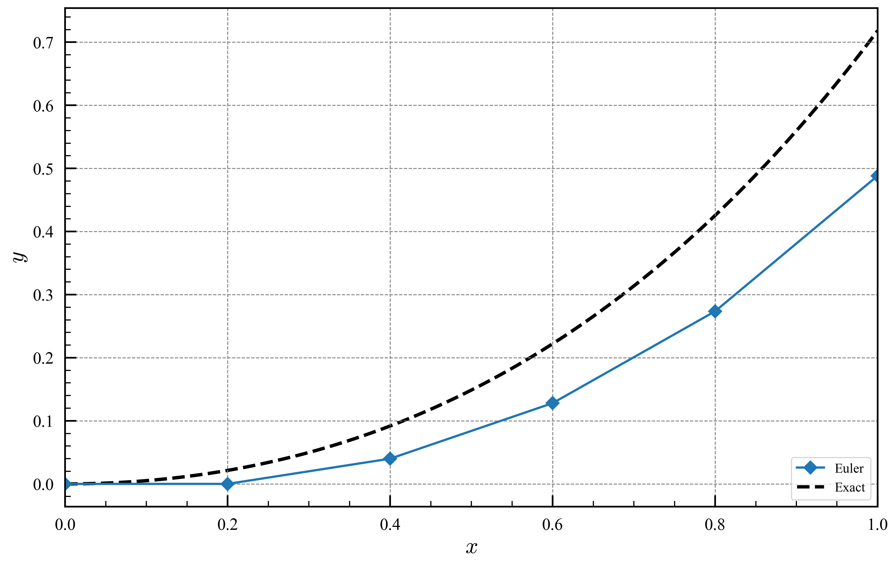
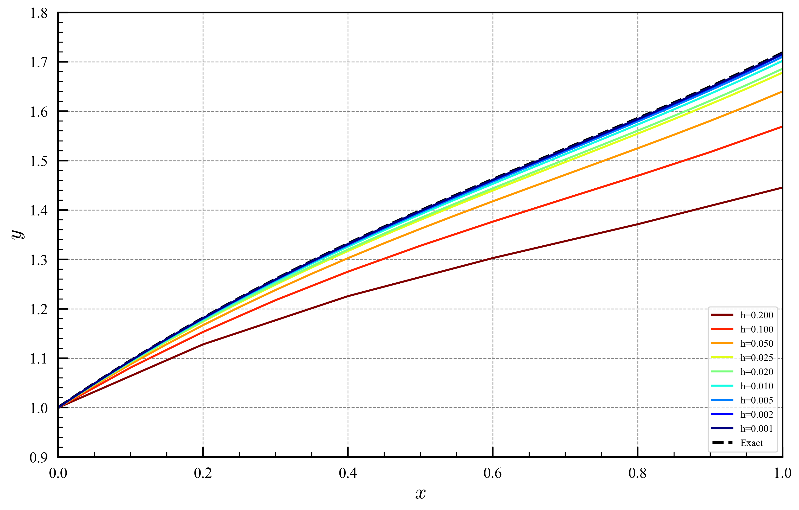
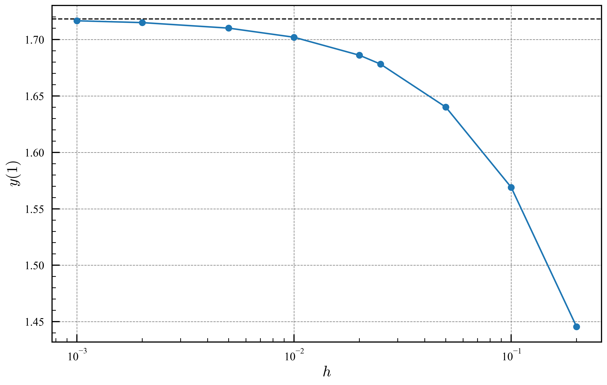
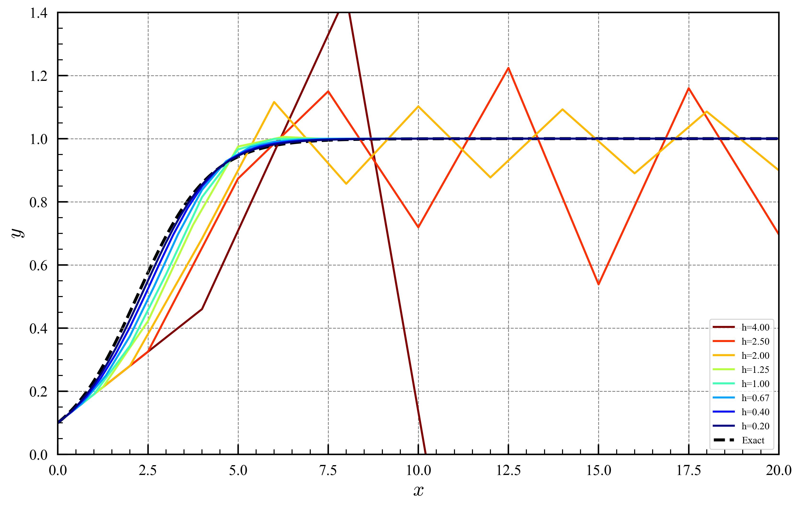
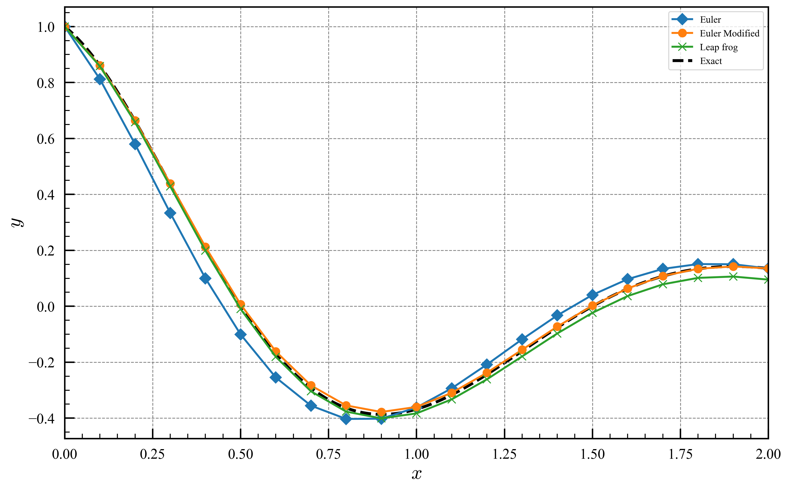
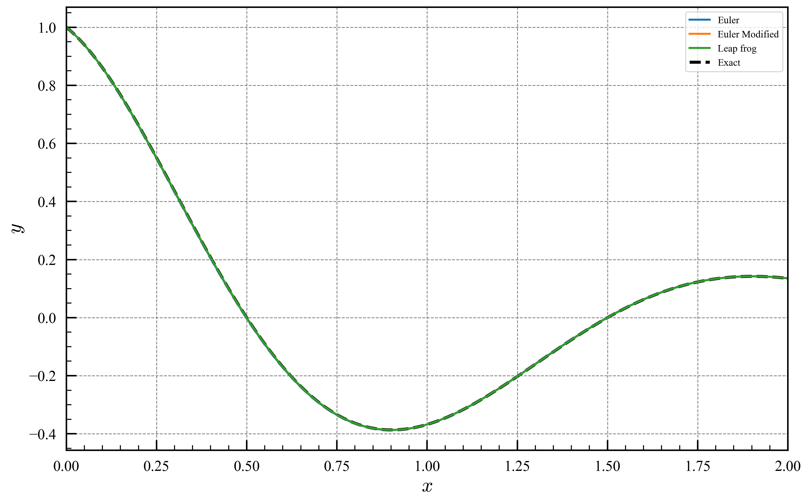
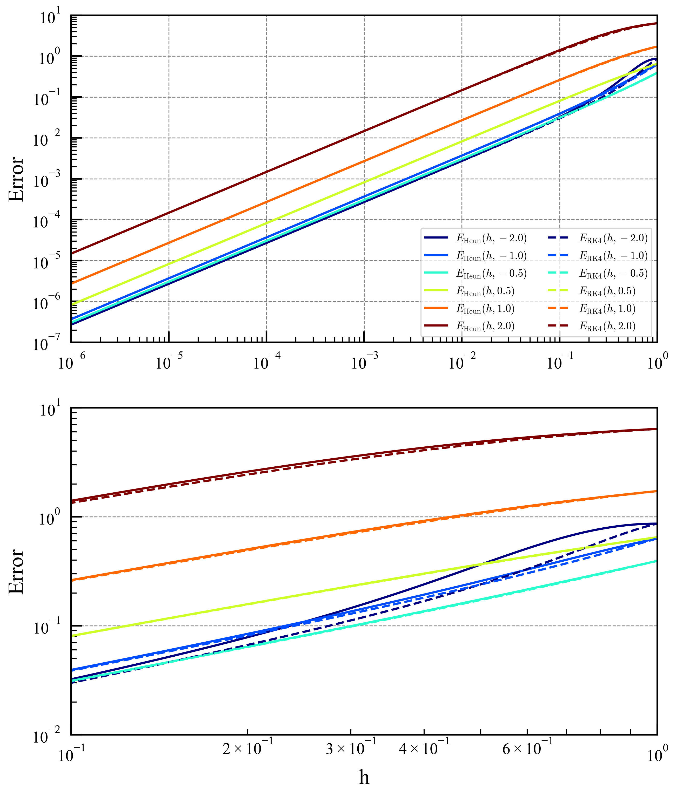
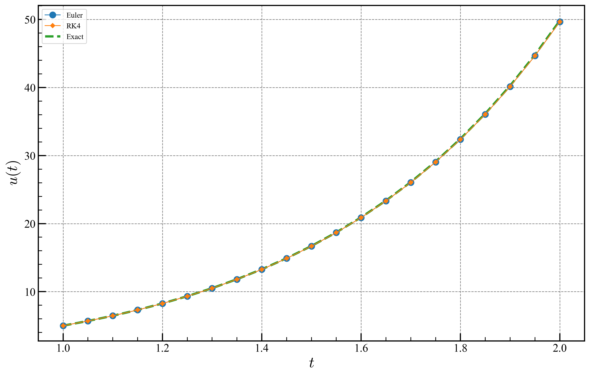

# 生物生産工学Ⅰ

## コンパイル
[Intel oneAPI](https://www.intel.com/content/www/us/en/developer/tools/oneapi/toolkits.html#gs.hc0791)と[GNU make](https://gnuwin32.sourceforge.net/packages/make.htm)があればコンパイル・実行できます．
```
make test01
```

適当なところでクローンして使ってください．
```
git clone https://github.com/ysy307/Lecture.git
```


## Lecture_01.f90
### 問1.1   
$` x = 0.00002311 `$ のとき $` \dfrac{1}{\sqrt{1-x}}-\dfrac{1}{\sqrt{1+x}} `$ の値をコンピュータにより，単精度で有効数字4桁まで計算せよ．

実行結果
```
 single   :  2.3126602E-05
 double   :  2.311000000765340E-005
 quad     :  2.311000000771400389761936948062395E-0005
 Diff(d-s): -1.6601916E-08
 Diff(q-d):  6.060690144193970E-017
```

### 問1.2
$` x=0.003 `$ のとき，次式を単精度により数値計算し，その結果を比較検討せよ．
```math
\begin{equation*}
\displaystyle
  s_1=\frac{1}{\sqrt{1-\sin^2x}}-1,\quad s_2=\frac{\sin^2 x}{(1+\cos x)(\cos x)}
\end{equation*} 
```

実行結果

```
 s1-single:  4.5299530E-06
 s2-single:  4.5000174E-06
 s1-double:  4.500016875130797E-006
 s2-double:  4.500016875061763E-006
 s1-quad  :  4.500016875061762725372473882625120E-0006
 s2-quad  :  4.500016875061762725372473882663843E-0006
```

### 問1.4
無限級数
```math
\begin{equation*}
\displaystyle
  \frac{\pi}{4}=1-\frac{1}{3}+\frac{1}{5}-\cdots=\sum_{k=0}^{\infty}\frac{(-1)^k}{2k+1}
\end{equation*}
```
をエイトケン加速のプログラムにより求めよ．ただし，講義で示した数列 $` S_n^{(k)} `$ の $` n=9 `$ まで求めよ．

実行結果: $` S_9^{(9)} `$
```
0.78539875048231589
```

## Lecture_02.f90
### 問2.2
次の3点を通る２次関数の，$` x=1.16 `$ における値を求めよ．
| $i$ |$x_i$  | $y_i$   |
|:---:|:-----:|:-------:|
| 1   | 1.1   | 0.89121 |
| 2   | 1.2   | 0.03204 |
| 3   | 1.3   | 0.96356 |

実行結果

```math
y_{obj} = a - bx- cx^2
```

```
a (LU) =  128.52762000000
b (LU) = -214.52105000000
c (LU) =   89.53450000000
a      =  128.52762000000
b      = -214.52105000000
c      =   89.53450000000
y_obj  =    0.16082542701

```
### 問2.3
$` \log 9.2 `$ をラグランジュの内挿を用いて計算せよ．ただし， $` f(x)=\log x `$ とし，補間点として下の 4 点をとるものとする．

|$x$  | $f(x)$  |
|:---:|:-------:|
|9.0  | 2.19722 |
|9.5  | 2.25129 |
|10.0 | 2.30259 |
|11.0 | 2.39790 |

実行結果
```
L (9.2) = 2.219196720000
ln(9.2) = 2.219203484055
```
### 問2.5
```math
\begin{equation*}
\displaystyle
  f(x)=\frac{1}{1+25x^2}
\end{equation*}
```

を区間 $` x=[-1,1] `$ で補間点を等間隔 $` x_i= - 1 + 2i / N \quad(i=0,1,2,\ldots ,N) `$ にとり， $` N= 12 , 24 , 36 , 48 `$ について 1 次，2 次，3 次，4 次のラグランジュ補間式および 3 次スプライン関数で補間し，それぞれの精度を調べよ．誤差の指標として，それそれの補間法による最適補間関数 $` f_m(x) `$ と元の関数 $` f(x) `$ 差 $` f_m(x)-f(x) ` $ の $` L_2 `$ ノルムの 2 乗を計算せよ．

実行結果
```
Enter the number of division, N:
12
Enter Size(0:small, 1:medium, 2:big)
1
Size = 248832
norm =  1.15646901E+02 6.61263056E+00 2.02399847E-02 4.51972866E-03 8.19846850E-01
MSE  =  4.64758959E-04 2.65746791E-05 8.13399590E-08 1.81637758E-08 3.29478061E-06
```
normおよびMSEは左から1,2,3,4次ラグランジュ補間，3次スプライン補間である．

## Lecture_03.f90
### 問3.1
```math
\begin{equation*}
\displaystyle
I=\int_{0}^{\frac{\pi}{2}}\sin x~\mathrm{d}x
\end{equation*}
```
を $` N = 8 `$ として台形公式により積分値を求めよ．

実行結果

解析解：$` 1 `$
```
The integral of sin(x) from 0 to pi/2 is   0.996785171886170
Error is  3.2148281E-03
```

### 問3.2
```math
\begin{equation*}
\displaystyle
I=\int_{0}^{\frac{\pi}{2}}\sin x~\mathrm{d}x
\end{equation*}
```
を $` N = 8 `$ としてシンプソン則により積分値を求めよ．

実行結果

解析解：$` 1 `$
```
The integral of sin(x) from 0 to pi/2 is    1.00000829552397
Error is -8.2955240E-06
```

### 問3.3
```math
\begin{equation*}
\displaystyle
S=\int_{0}^{1}\frac{4}{1+x^2}~\mathrm{d}x
\end{equation*}
```
をシンプソン則で計算し，分割数$` N `$と精度の関係を検討せよ．

#### 計算結果

解析解： $` \pi `$
```
Enter even division number (N):
4
The integral is    3.14156862745098
Error is -2.4026139E-05

Enter even division number (N):
8
The integral is    3.14159250245871
Error is -1.5113109E-07

Enter even division number (N):
64
The integral is    3.14159265358922
Error is -5.7731597E-13

Enter even division number (N):
1048576
The integral is    3.14159265358977
Error is -2.4868996E-14
```

### 問3.4
次の定積分の値を，台形公式およびシンプソン則を用いて数値計算せよ．ただし，それぞれの公式において，分割数を$` N= 8 , 16 , 32 , 64 `$ の場合について計算せよ．

```math
\begin{equation*}
\displaystyle
S=\int_{0}^{2}x^5~\mathrm{d}x
\end{equation*}
```

#### 計算結果

解析解：$` \dfrac{32}{3} `$
```
Number of Division: 8
The integral is    10.6718750000000
Error is  5.2083333E-03
Number of Division: 16
The integral is    10.6669921875000
Error is  3.2552083E-04
Number of Division: 32
The integral is    10.6666870117188
Error is  2.0345052E-05
Number of Division: 64
The integral is    10.6666679382324
Error is  1.2715658E-06
```

### 問3.5
問 3.4 における定積分の値をガウス・ルジャンドル積分公式$` (N=3) `$を用いて求めよ．

#### 計算結果

解析解：$` \dfrac{32}{3} `$
```
Number of Division: 3
The integral is    10.6666666666667
Error is  3.5527137E-15
```

### 問3.6
下記の式に台形公式，シンプソン公式，ガウス・ルジャンドル積分公式を適用し，数値計算したときの積分$` I `$に含まれる誤差$` [I-\pi/2] `$ の値を表形式で示せ．ただし，$` N = 8 , 12 , 16 , 20 `$  とせよ．
```math
\begin{equation*}
\displaystyle
    f(x) =  \sqrt{1-x^2}
\end{equation*}
```
```math
\begin{equation*}
\displaystyle
    I=\int_{-1}^{1} f(x) ~\mathrm{d}x = \int_{-1}^{1}\sqrt{1-x^2} ~\mathrm{d}x = \dfrac{\pi}{2}
\end{equation*}
```

実行結果

```
Trapezoidal| Number of Division: 8
The integral is    1.49785453405122     
Error is  7.2941793E-02
Simpson| Number of Division: 8
The integral is    1.54179757747348     
Error is  2.8998749E-02
Gaussian_Quadrature| Number of Division: 1
The integral is    2.00000000000000     
Error is  4.2920367E-01

Trapezoidal| Number of Division: 12
The integral is    1.53099151114742     
Error is  3.9804816E-02
Simpson| Number of Division: 12
The integral is    1.55506311840056     
Error is  1.5733208E-02
Gaussian_Quadrature| Number of Division: 2
The integral is    1.63299316185545     
Error is  6.2196835E-02

Trapezoidal| Number of Division: 16
The integral is    1.54490957217859     
Error is  2.5886755E-02
Simpson| Number of Division: 16
The integral is    1.56059458488771     
Error is  1.0201742E-02
Gaussian_Quadrature| Number of Division: 3
The integral is    1.59161725781520     
Error is  2.0820931E-02

Trapezoidal| Number of Division: 20
The integral is    1.55225916312416     
Error is  1.8537164E-02
Simpson| Number of Division: 20
The integral is    1.56350407935162     
Error is  7.2922474E-03
Gaussian_Quadrature| Number of Division: 4
The integral is    1.58027752770007     
Error is  9.4812009E-03
```

## Lecture_04.f90
### 問4.1

$` f(x)=x-\cos x `$ を2分法，1次元ニュートン法でそれそれで計算せよ．

#### 計算結果

$` f'(x)=1+\sin x `$
```
Binary search       :  0.7390851332
Newton Method       :  0.7390851332
Convergence delta   :  1.0E-10
Convergence epsilon :  5.0E-06
```

### 問4.2
```math
\begin{equation*}
  f(x)=x^3+x-1=0
\end{equation*}
```
に対して1次元ニュートン法を適用せよ．

#### 計算結果

$f'(x)=3x^2+1$
```
Newton Method       :  0.6823278038
Convergence delta   :  1.0E-10
```
### 問4.3
ニュートン法により次の方程式の実数解を求めよ．
```math
\begin{equation*}
  \sin (x) = \dfrac{1}{2}x
\end{equation*}
```

#### 計算結果

```
Initial value       :  2.0000000000
Newton Method       :  1.8954942670
Convergence delta   :  1.0E-10
Initial value       :  0.5000000000
Newton Method       :  0.0000000000
Convergence delta   :  1.0E-10
Initial value       : -2.0000000000
Newton Method       : -1.8954942670
Convergence delta   :  1.0E-10
```

### 問4.4
2分法により次の方程式の実根を有効数字6桁まで求めよ．なお，初期値として $` a^{(0)}=-3.0 `$，$` b^{(0)}=0 `$ とし，判定条件式$` \left|f(c^{(k+1)})\right|<\delta `$，$` \left|a^{(k)}-b^{(k)}\right|<\varepsilon `$ で $` \delta=10^{-10} `$ および $` \varepsilon=5.0\times 10^{-5} `$ とせよ．
```math
\begin{equation*}
  f(x)=x^3 + 6x^2 + 21x + 32 = 0
\end{equation*}
```

#### 計算結果

実数解 $` -2+ \sqrt[3]{3} - 3^{2/3} `$
```
Binary search       : -2.6378342527
Convergence delta   :  1.0E-10
Convergence epsilon :  5.0E-06
```

### 問4.5

ニュートン法により次の方程式の実根を有効数字6桁まで求めよ．なお，初期値として $`  a^{(0)}=0 `$ を用い，判定条件には $` \delta=10^{-10} `$ を用いよ．
```math
\begin{equation*}
  f(x)=x^3 + 6x^2 + 21x + 32 = 0
\end{equation*}
```

#### 計算結果

実数解 $` -2+ \sqrt[3]{3} - 3^{2/3} `$
```
Newton Method       : -2.6378342527
Convergence delta   :  1.0E-10
```
### 問4.6
2次元ニュートン法により次の連立方程式の根を有効数字6桁まで求めよ．ただし，初期条件を $` (x^{(0)}, y^{(0)})=(-1,-2) `$　とし，収束条件 $` (f(x^{(k+1)}, y^{(k+1)}))^2 + (g(x^{(k+1)}, y^{(k+1)}))^2 < \delta^2 `$ においては $` \delta=10^{-10} `$を用いよ．
```math
\begin{equation*}
  \left\{ \,
  \begin{aligned}
      f(x,y) &= x^3 - 3 x y^2 + 6 x^2 - 6 y^2 + 21 x +32 = 0\\
      g(x,y) &= 3 x^2 y - y^3 + 12 x y + 21 y=0
    \end{aligned}
  \right.
\end{equation*}
```

#### 計算結果

$` x\approx -2.6378, y = 0            `$<br>
$` x\approx -1.6811, y\approx -3.0504 `$<br>
$` x\approx -1.6811, y\approx  3.0504 `$<br>

```
Initial value     : -1.0000000000 -2.0000000000
Newton Method     : -1.6810828736 -3.0504301992
Convergence delta :  1.0E-10
```

### 問4.7
1次元ニュートン法により問 4.5 で示した方程式の複素根を有効数字6桁まで求めよ．なお，初期値を $` z= -1-3i `$ とし，判定条件において $` \delta = 10^{-10} `$ を用いよ．


#### 計算結果

問4.6の初期値を変えればよい
```
Initial value     : -1.0000000000 -3.0000000000
Newton Method    z= -1.6810828736-3.0504301992i
Convergence delta :  1.0E-10
```

## Lecture_05.f90
### 問5.1
ガウスの消去法のプログラムを作れ．

適当に実装する．問2.2でも実際に計算してみるとよい．

### 問5.2
ガウスの消去法を用いて，次の連立1次方程式を解け．
```math
\begin{equation}
  \left\{ \,
  \begin{aligned}
      & x+2y+z=3\\
      & 3x+8y+7z=5\\
      & 2x+7y+4z=8
    \end{aligned}
  \right.
\end{equation}
```
```math
\begin{equation}
  \left\{ \,
  \begin{aligned}
      & 2w-4x+3y-z=3\\
      & w-2x+5y-3z=0\\
      & 3w-6x-y-z=0
    \end{aligned}
  \right.
\end{equation}
```

#### 計算結果
式(1)　厳密解： $` x=1, y=2, y=-2 `$
```
(x, y, z) = (  1.00000,  2.00000, -2.00000)
```
式(2)

これは未知数4に対して式の本数が3なので数値計算ができない．気合の手計算により求める．
```math
\begin{equation*}
  \left\{ \,
  \begin{aligned}
      w &= 2x + 1\\
      y &= 1     \\
      z &= 2
    \end{aligned}
  \right.
\end{equation*}
```

### 問5.3
ヤコビ法を用いて，次の連立方程式を解け．ただし初期近似解を $` x_1=x_2=x_3=x_4=x_5=0 `$ とし，収束判定には $` \delta=10^{-8} `$ を用いよ． 
```math
\begin{equation}
  \left\{ \,
  \begin{aligned}
      & 10x_1+3x_2+x_3+2x_4+x_5=-22\\
      & x_1+19x_2+2x_3-x_4+5x_5=27\\
      & -x_1+x_2+30x_3+x_4+10x_5=89\\
      & -2x_1+x_3+20x_4+5x_5=-73\\
      & -3x_1+5x_2+x_3-2x_4+25x_5=22
    \end{aligned}
  \right.
\end{equation}
```

#### 計算結果
厳密解： $` x_1 = -2, x_2 = 1, x_3 = 3, x_4 = -4, x_5 = 0 `$
```
Jacobi method converged after 16 iterations.
Jacobi Method:
(x1, x2, x3, x4, x5) = (-1.9999999990, 0.9999999996, 2.9999999998,-3.9999999999, 0.0000000006)        
convergence delta :  1.0E-08
LU Decomposition:
(x1, x2, x3, x4, x5) = (-2.0000000000, 1.0000000000, 3.0000000000,-4.0000000000,-0.0000000000)   
```

### 問5.4
ガウス・ザイデル法を用いて，問5.2と同じ連立方程式を解け．ただし初期近似解を $` x_1=x_2=x_3=x_4=x_5=0 `$ とし，収束判定には $` \delta=10^{-8} `$ を用いよ． 

#### 計算結果
厳密解： $` x_1 = -2, x_2 = 1, x_3 = 3, x_4 = -4, x_5 = 0 `$
```
Gauss-Seidel method converged after 11 iterations.
Gauss Seidel Method:
(x1, x2, x3, x4, x5) = (-2.0000000007, 1.0000000002, 3.0000000003,-3.9999999998,-0.0000000001)        
convergence delta :  1.0E-08
LU Decomposition:
(x1, x2, x3, x4, x5) = (-2.0000000000, 1.0000000000, 3.0000000000,-4.0000000000,-0.0000000000)  
```

### 問5.5
次の連立方程式をSORをもちいて数値的に解け．ただし，ただし収束判定には $` \delta=10^{-18} `$ を用いよ． 
```math
\begin{equation}
  \left\{ \,
  \begin{aligned}
      & 5x_1+4x_2=13\\
      & 2x_1+3x_2=8
    \end{aligned}
  \right.
\end{equation}
```

#### 計算結果
厳密解： $` x=1, y=2 `$
```
Enter the relaxation parameter omega:
1.2
SOR method converged after 26 iterations.
SOR Method:
(x1, x2) = ( 1.0000000000, 2.0000000000)
convergence delta :  1.0E-18
LU Decomposition:
(x1, x2) = ( 1.0000000000, 2.0000000000)
```

### 問5.6
問5.5の連立方程式を $` \omega = 1.5 `$ として解き， $` \omega = 1.2 `$ を用いたときの計算と解の収束の速さを比較せよ．

#### 計算結果
厳密解： $` x=1, y=2 `$

これよくよく考えると，倍精度でできる最小幅は $` 2.220\times 10^{-16} `$ なので $` \delta=10^{-18} `$ を厳密には満たせない．最低でも4倍精度でやらないとまずそうかも．

```
Enter the relaxation parameter omega:
1.2
SOR method converged after 29 iterations.
SOR Method:
(x1, x2) = ( 1.0000000000, 2.0000000000)
convergence delta :  1.0E-18

Enter the relaxation parameter omega:
1.5
SOR method converged after 63 iterations.
SOR Method:
(x1, x2) = ( 1.0000000000, 2.0000000000)
convergence delta :  1.0E-18
```


## Lecture_06.f90
### 問6.1
初期値問題
```math
\begin{equation*}
  y'=x+y, y(0) = 0
\end{equation*}
```
にオイラー法を適用せよ． $` h=0.2 `$ として， $` y_1, \ldots, y_5 `$ を計算せよ．

#### 計算結果
求積解
```math
\begin{equation*}
  y = -x + \exp(x) - 1
\end{equation*}
```
```
x   y   Exact
  0.000000000000E+00  0.000000000000E+00  0.000000000000E+00
  2.000000000000E-01  4.000000000000E-02  2.140275816017E-02
  4.000000000000E-01  1.280000000000E-01  9.182469764127E-02
  6.000000000000E-01  2.736000000000E-01  2.221188003905E-01
  8.000000000000E-01  4.883200000000E-01  4.255409284925E-01
  1.000000000000E+00  7.859840000000E-01  7.182818284590E-01
```


### 問6.2
次の微分方程式を前進オイラー法により区間 $` [0, 1] `$ の範囲で数値計算し，その精度について検討せよ．ただし，初期条件を $` y(0) = 1 `$ とする．このとき，差分間隔 $` h `$ をいろいろな値にとり計算を繰り返し行うことにより $` x=1 `$ における $` y `$ に含まれる誤差について検討せよ．
```math
\begin{equation*}
  \dfrac{\mathrm{d}y}{\mathrm{d}x} = y + x^2 - 2x
\end{equation*}
```

#### 計算結果
求積解
```math
\begin{equation*}
  y = \exp(x) - x^2
\end{equation*}
```
$` y(1) =  1.718281828459`$

```
x   y   Exact
N=10
  1.000000000000E+00  1.569054130711E+00  1.718281828459E+00
N=20
  1.000000000000E+00  1.640095834665E+00  1.718281828459E+00
N=40
  1.000000000000E+00  1.678243599249E+00  1.718281828459E+00
N=100
  1.000000000000E+00  1.702032449099E+00  1.718281828459E+00
```

x vs y

h vs y(1)

### 問6.3
次の微分方程式（ロジスティック方程式）を前進オイラー法により $` x=[0, 20] `$ の範囲で数値計算し，解法の安定性について比較検討せよ．ただし，初期条件を $` y(0) = 0.1 `$ とする．差分間隔 $` h `$ をいろいろな値にとり計算を繰り返し行うと，求積法による正しい解以外に差分解特有の性質を持った解が現れることを確かめよ．
```math
\begin{equation*}
  \dfrac{\mathrm{d}y}{\mathrm{d}x} = y - y^2
\end{equation*}
```


#### 計算結果
求積解
```math
\begin{equation*}
  y = \dfrac{\exp(x)}{9 + \exp(x)}
\end{equation*}
```
$` N=20 `$ の結果
```
x   y   Exact
  0.000000000000E+00  1.000000000000E-01  1.000000000000E-01
  1.000000000000E+00  1.900000000000E-01  2.319693166841E-01
  2.000000000000E+00  3.439000000000E-01  4.508530603793E-01
  3.000000000000E+00  5.695327900000E-01  6.905678577030E-01
  4.000000000000E+00  8.146979811148E-01  8.584864497582E-01
  5.000000000000E+00  9.656631617971E-01  9.428256185740E-01
  6.000000000000E+00  9.988209815422E-01  9.781780512370E-01
  7.000000000000E+00  9.999986099155E-01  9.918598678672E-01
  8.000000000000E+00  9.999999999981E-01  9.969899242601E-01
  9.000000000000E+00  1.000000000000E+00  9.988905440229E-01
  1.000000000000E+01  1.000000000000E+00  9.995915675174E-01
  1.100000000000E+01  1.000000000000E+00  9.998497072842E-01
  1.200000000000E+01  1.000000000000E+00  9.999447051465E-01
  1.300000000000E+01  1.000000000000E+00  9.999796574492E-01
  1.400000000000E+01  1.000000000000E+00  9.999925162975E-01
  1.500000000000E+01  1.000000000000E+00  9.999972468867E-01
  1.600000000000E+01  1.000000000000E+00  9.999989871845E-01
  1.700000000000E+01  1.000000000000E+00  9.999996274057E-01
  1.800000000000E+01  1.000000000000E+00  9.999998629302E-01
  1.900000000000E+01  1.000000000000E+00  9.999999495748E-01
  2.000000000000E+01  1.000000000000E+00  9.999999814496E-01
```

x vs y

### 問6.4
次の微分方程式をオイラー法とリープ・フロッグ法の2通りの方法により $` x=[0, 2] `$ の範囲で数値計算し，数値解の精度について比較検討せよ．ただし，初期条件を $` y(0) = 1 `$ とする．
```math
\begin{equation*}
  \dfrac{\mathrm{d}y}{\mathrm{d}x} = - y - \pi\exp(-x)\sin \pi x
\end{equation*}
```


#### 計算結果
求積解
```math
\begin{equation*}
  y = \exp(-x) \cos\pi x
\end{equation*}
```
$` N=20 `$
```
x   y_E   y_ME   y_LF   Exact
  0.000000000000E+00  1.000000000000E+00  1.000000000000E+00  1.000000000000E+00  1.000000000000E+00
  1.000000000000E-01  8.121578840445E-01  8.610789420222E-01  8.605889342491E-01  8.605515226108E-01
  2.000000000000E-01  5.797567623703E-01  6.641548237153E-01  6.625577075197E-01  6.623670930575E-01
  3.000000000000E-01  3.334945903981E-01  4.388834676233E-01  4.360233078065E-01  4.354420247463E-01
  4.000000000000E-01  9.986475193662E-02  2.123204254075E-01  2.084289772759E-01  2.071402858952E-01
  5.000000000000E-01 -1.006689497301E-01  6.750201017509E-03  2.351263922402E-03  3.713929155009E-17
  6.000000000000E-01 -2.545777606277E-01 -1.616251729273E-01 -1.658202440525E-01 -1.695921222638E-01
  7.000000000000E-01 -3.553321970540E-01 -2.831659553856E-01 -2.863597806829E-01 -2.918855180738E-01
  8.000000000000E-01 -4.027712474538E-01 -3.545468202966E-01 -3.559451724743E-01 -3.635147680357E-01
  9.000000000000E-01 -4.019641296766E-01 -3.779373973999E-01 -3.768195163382E-01 -3.866707242242E-01
  1.000000000000E+00 -3.617677167089E-01 -3.597948477825E-01 -3.555613802040E-01 -3.678794411714E-01
  1.100000000000E+00 -2.932756365090E-01 -3.094566829787E-01 -3.016545316178E-01 -3.165792132373E-01
  1.200000000000E+00 -2.083300969415E-01 -2.377074212993E-01 -2.260331465235E-01 -2.436712360443E-01
  1.300000000000E+00 -1.182303564162E-01 -1.554637616978E-01 -1.397489479537E-01 -1.601901687262E-01
  1.400000000000E+00 -3.272828671531E-02 -7.268515843290E-02 -5.286827199848E-02 -7.620265261922E-02
  1.500000000000E+00  4.064294914788E-02  2.424700540715E-03  2.633496749053E-02  1.571910475652E-16
  1.600000000000E+00  9.690194527447E-02  6.390028274628E-02  9.186529281944E-02  6.238945516548E-02
  1.700000000000E+00  1.336426289465E-01  1.081906759538E-01  1.401814294893E-01  1.073786812750E-01
  1.800000000000E+00  1.508021584109E-01  1.340683531074E-01  1.701009393643E-01  1.337296097225E-01
  1.900000000000E+00  1.502421466763E-01  1.423276681770E-01  1.824922164312E-01  1.422482099450E-01
  2.000000000000E+00  1.352179320087E-01  1.353406315481E-01  1.798225009346E-01  1.353352832366E-01
```

N=20

N=1000
### 問6.5
次の微分方程式をホイン法（2次のルンゲ・クッタ法）により差分近似し，その初期値問題の近似解を $` x=[0, 1] `$ の範囲で求め， $` x=1 `$ における近似会と厳密解との誤差を評価せよ．ただし，初期条件を $` y(0) = y_0 `$ とする．
```math
\begin{equation*}
  \dfrac{\mathrm{d}y}{\mathrm{d}x} = ay
\end{equation*}
```

#### 計算結果
求積解
```math
\begin{equation*}
  y = y_0\exp (ax)
\end{equation*}
```
ホイン法は次のようにあらわされる．
```math
\begin{equation*}
  \left\{ \,
  \begin{aligned}
      k_1    &= f(x_i, y_i)\\
      k_2    &= f(x_i, y_i + hk_1)\\
      y_{i+1}&= y_i + \dfrac{h}{2}(k_1+k_2)
    \end{aligned}
  \right.
\end{equation*}
```
ここで $` f(x,y)=ay `$ とすれば，$` y_{i+1} `$ は次のようにあらわされる．
```math
\begin{equation}
  y_{i+1} = \left(1 + ah + \dfrac{1}{2}a^2h^2 \right)y_i\tag{6.5.1}
\end{equation}
```
つまり，誤差は $`\mathcal{O}(\Delta h^3)`$ であり，2次精度である．ここで， $` x=[0, 1] `$ の領域を $` N `$ 分割すれば，
```math
\begin{equation*}
  h = \dfrac{1}{N},\quad N = \dfrac{1}{h}
\end{equation*}
```
式(6.5.1)は初期値 $` y(0)=y_0 `$ を用い，$` h = \dfrac{1}{N} `$ とすれば次のようにあらわせる．
```math
\begin{equation*}
  y(1) = y_0\left(1 + \dfrac{a}{N} + \dfrac{1}{2}\dfrac{a^2}{N^2} \right)^{N-1}
\end{equation*}
```
$` N\rightarrow h `$ とすれば
```math
\begin{equation*}
  y(1) = y_0\left(1 + ah + \dfrac{1}{2}a^2h^2 \right)^{1/h-1}
\end{equation*}
```
解析解と係数比較すれば
```math
\begin{equation*}
  \left(1 + ah + \dfrac{1}{2}a^2h^2 \right)^{1/h-1} \approx \exp(a)
\end{equation*}
```
となることが推測される． $` E_{\mathrm{Heun}} `$ を適当な範囲で図示すれば，誤差について考えられる．
```math
\begin{equation*}
  E_{\mathrm{Heun}}(h, a) = \left|\left(1 + ah + \dfrac{1}{2}a^2h^2 \right)^{1/h-1} - \exp(a)\right|
\end{equation*}
```


### 問6.6
次の常微分方程式を修正オイラー法で求めよ．
```math
\begin{equation*}
  y' =  y \qquad y(0)=1.0
\end{equation*}
```

#### 計算結果
求積解
```math
\begin{equation*}
  y = \exp(x)
\end{equation*}
```

$` N=20 `$
```
x   y   Exact
  0.000000000000E+00  1.000000000000E+00  1.000000000000E+00
  5.000000000000E-01  1.625000000000E+00  1.648721270700E+00
  1.000000000000E+00  2.640625000000E+00  2.718281828459E+00
  1.500000000000E+00  4.291015625000E+00  4.481689070338E+00
  2.000000000000E+00  6.972900390625E+00  7.389056098931E+00
  2.500000000000E+00  1.133096313477E+01  1.218249396070E+01
  3.000000000000E+00  1.841281509399E+01  2.008553692319E+01
  3.500000000000E+00  2.992082452774E+01  3.311545195869E+01
  4.000000000000E+00  4.862133985758E+01  5.459815003314E+01
  4.500000000000E+00  7.900967726856E+01  9.001713130052E+01
  5.000000000000E+00  1.283907255614E+02  1.484131591026E+02
  5.500000000000E+00  2.086349290373E+02  2.446919322642E+02
  6.000000000000E+00  3.390317596856E+02  4.034287934927E+02
  6.500000000000E+00  5.509266094891E+02  6.651416330444E+02
  7.000000000000E+00  8.952557404198E+02  1.096633158428E+03
  7.500000000000E+00  1.454790578182E+03  1.808042414456E+03
  8.000000000000E+00  2.364034689546E+03  2.980957987042E+03
  8.500000000000E+00  3.841556370512E+03  4.914768840299E+03
  9.000000000000E+00  6.242529102083E+03  8.103083927575E+03
  9.500000000000E+00  1.014410979088E+04  1.335972682966E+04
  1.000000000000E+01  1.648417841019E+04  2.202646579481E+04

```

### 問6.5
問6.5の初期値問題に4次のルンゲ・クッタ法を適用せよ．

#### 計算結果
求積解
```math
\begin{equation*}
  y = y_0\exp (ax)
\end{equation*}
```
4次のルンゲ・クッタ法は次のようにあらわされる．
```math
\begin{equation*}
  \left\{ \,
  \begin{aligned}
      k_1    &= f(x_i, y_i)\\
      k_2    &= f(x_i, y_i + \dfrac{h}{2}k_1)\\
      k_3    &= f(x_i, y_i + \dfrac{h}{2}k_2)\\
      k_4    &= f(x_i, y_i + hk_3)\\
      y_{i+1}&= y_i + \dfrac{h}{6}(k_1+2k_2+2k_3+k_4)
    \end{aligned}
  \right.
\end{equation*}
```
整理すれば，
```math
\begin{equation}
  y_{i+1} = \left(1 + ah + \dfrac{1}{2}a^2h^2 + \dfrac{1}{6}a^3h^3 + \dfrac{1}{24} a^4h^4 \right)y_i\tag{6.7.1}
\end{equation}
```
つまり，誤差は $`\mathcal{O}(\Delta h^5)`$ であり，4次精度である．問6.5と同様に， $` E_{\mathrm{RK4}} `$ を適当に図示してやればいい．
```math
\begin{equation*}
  E_{\mathrm{RK4}}(h, a) = \left|\left(1 + ah + \dfrac{1}{2}a^2h^2 + \dfrac{1}{6}a^3h^3 + \dfrac{1}{24} a^4h^4 \right)^{1/h-1} - \exp(a)\right|
\end{equation*}
```


### 問6.8
```math
\begin{equation*}
  \dfrac{\mathrm{d}u}{\mathrm{d}t} = 2u+3t
\end{equation*}
```
の初期値問題
```math
\begin{equation*}
  u(1) = 5
\end{equation*}
```
の解を刻み幅 $` \Delta t = 0.05 `$ のオイラー法，ルンゲ・クッタ法で $` t=2 `$ まで計算し，結果をグラフ表示せよ．

#### 計算結果
求積解→わからん<br>
一般解
```math
\begin{equation*}
  u(t) = C \exp(2t) - \dfrac{3}{2}t - \dfrac{3}{4}
\end{equation*}
```
```
x   y_EM   y_RK4
  1.000000000000E+00  5.000000000000E+00  5.000000000000E+00
  1.050000000000E+00  5.916250000000E+00  5.916250000000E+00
  1.100000000000E+00  6.985620312500E+00  6.985620312500E+00
  1.150000000000E+00  8.232801587891E+00  8.232801587891E+00
  1.200000000000E+00  9.686465843938E+00  9.686465843938E+00
  1.250000000000E+00  1.137990846127E+01  1.137990846127E+01
  1.300000000000E+00  1.335179370065E+01  1.335179370065E+01
  1.350000000000E+00  1.564702043488E+01  1.564702043488E+01
  1.400000000000E+00  1.831772748001E+01  1.831772748001E+01
  1.450000000000E+00  2.142446103616E+01  2.142446103616E+01
  1.500000000000E+00  2.503753037824E+01  2.503753037824E+01
  1.550000000000E+00  2.923858215173E+01  2.923858215173E+01
  1.600000000000E+00  3.412242852370E+01  3.412242852370E+01
  1.650000000000E+00  3.979917012315E+01  3.979917012315E+01
  1.700000000000E+00  4.639666130550E+01  4.639666130550E+01
  1.750000000000E+00  5.406337294101E+01  5.406337294101E+01
  1.800000000000E+00  6.297171682775E+01  6.297171682775E+01
  1.850000000000E+00  7.332190616623E+01  7.332190616623E+01
  1.900000000000E+00  8.534643853553E+01  8.534643853553E+01
  1.950000000000E+00  9.931530174939E+01  9.931530174939E+01
  2.000000000000E+00  1.155420191565E+02  1.155420191565E+02
```
